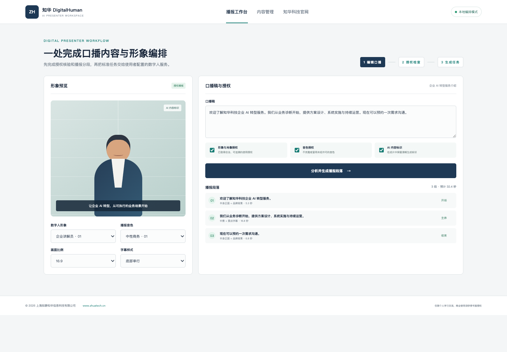

# ZhuaTech DigitalHuman｜知华科技企业数字人播报系统

[简体中文](README.md) | [English](README.en.md)

ZhuaTech DigitalHuman 是上海如静知华信息科技有限公司开发的企业数字人播报独立案例。项目围绕“口播稿—播报分段—授权核验—Provider 任务”构建可运行的前后端分离 MVP，适合产品介绍、培训课程和内部资讯等场景。

[知华科技官网](https://www.zhuatech.cn/) · Java 包名 `cn.zhuatech.digitalhuman` · API `POST /api/digitalhuman/plan`

> 默认只运行本地口播编排逻辑，不生成真实数字人视频，也不附带模型或密钥。使用者可在取得形象、肖像和音色授权后，自行配置合规服务。

## 能力边界

| 工作区 | 已实现 | 生产环境扩展点 |
| --- | --- | --- |
| 口播编辑 | 文本清洗、按句分段、时长估算 | 文案模型、术语库、敏感词策略 |
| 形象与音色 | 形象/音色 ID、双重授权门禁 | 数字资产库、授权有效期 |
| 画面编排 | 横竖屏、视觉提示、字幕段落 | 数字人 Provider、背景模板 |
| 内容治理 | AI 标识、检查项、阻断状态 | 人工复核、审计与水印 |
| 管理端 | 项目、任务、授权状态 | 多租户、队列与回调 |

## 页面预览

前台工作台将形象预览、口播稿、分段结果放在同一创作视野；管理端展示项目、生成任务、授权和 Provider 状态。



## 本地启动

```bash
cd backend && mvn spring-boot:run
# 新终端
cd frontend && python3 -m http.server 8088
```

浏览器访问 `http://localhost:8088`。也可以执行 `docker compose up --build`。前端连接不到 Java 服务时，会使用等价的本地演示逻辑。

## 服务适配

复制 `.env.example` 并填写使用者自己的 `ZHUATECH_DIGITAL_HUMAN_*` 配置。仓库不保存任何真实密钥、人物素材或第三方案例内容。

## 许可与咨询

本工程仅限个人学习、研究、非商业技术交流，**不得商用**。企业部署、项目交付、数字人服务接入、品牌替换或深度定制，须取得上海如静知华信息科技有限公司书面授权，详见 [LICENSE](LICENSE)。

| 微信咨询一 | 微信咨询二 |
| --- | --- |
|  |  |

SEO：数字人源码、AI 数字人系统、数字人口播、企业数字员工、虚拟主播、Java 数字人、数字人 Provider、知华科技。
